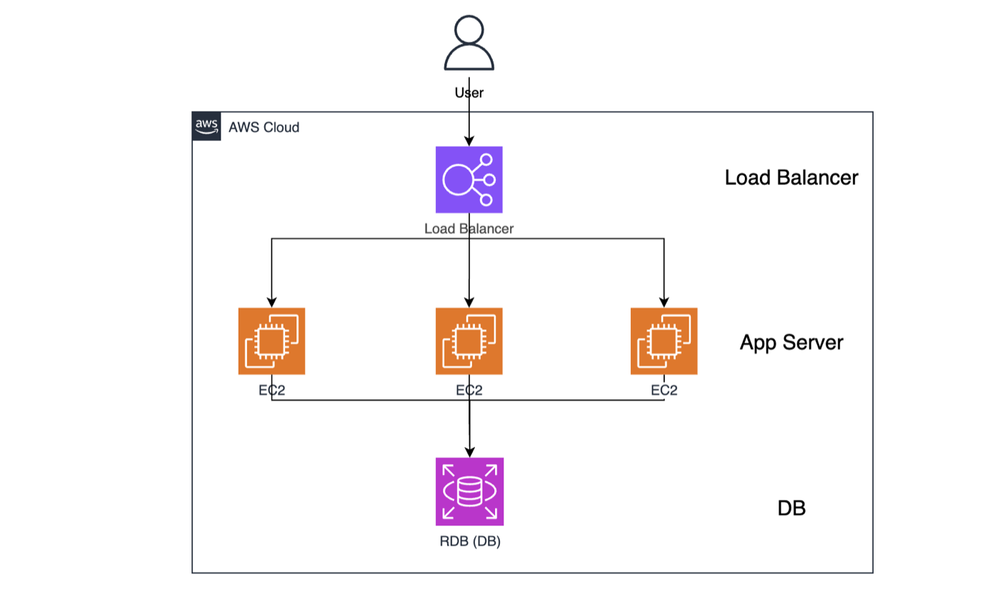
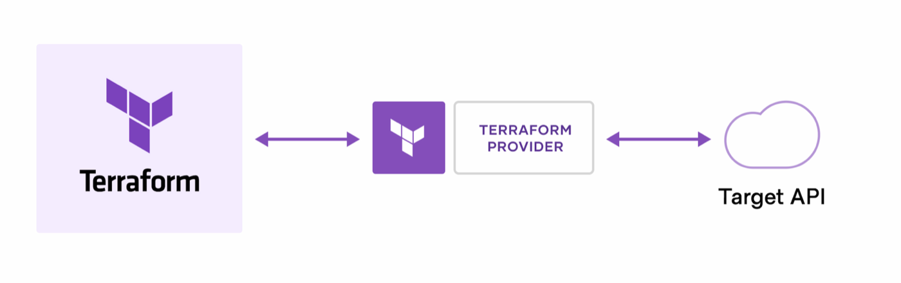
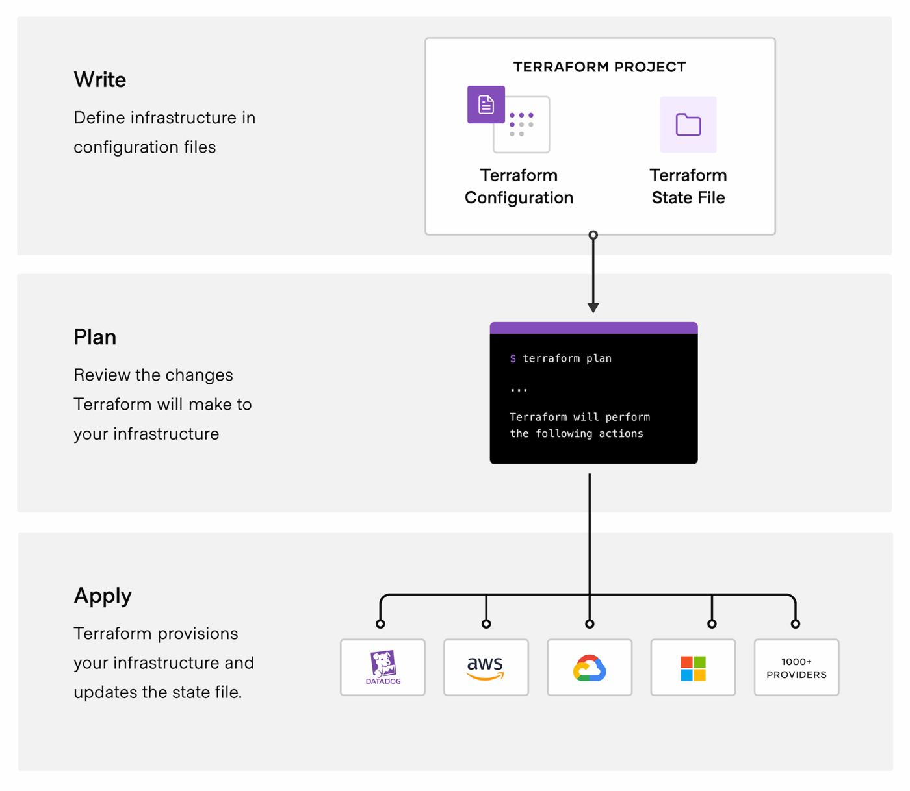
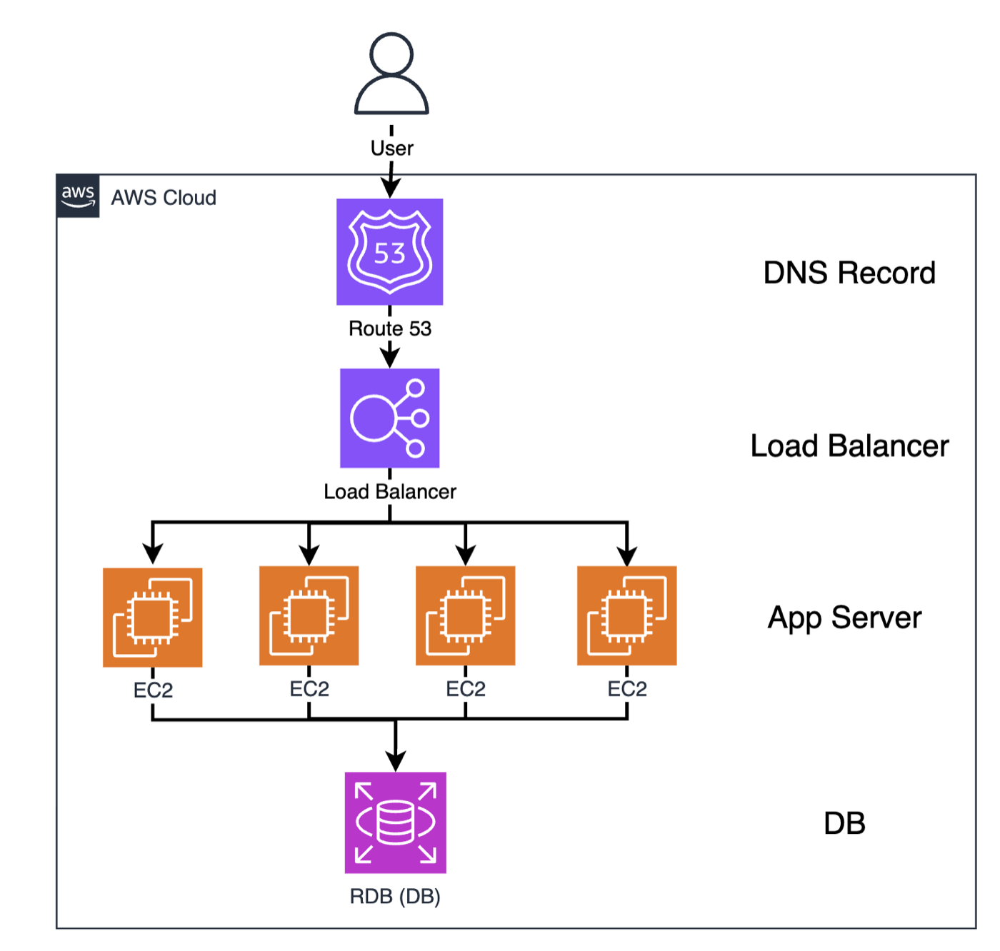

# Week 1 · 개념 워크북 — Terraform이 뭔가

> [!NOTE]
> **이 문서는 개념 파트(10분)입니다.** 손으로 치는 실습은 별도 문서 **`실습워크북.pdf`** 를 따라갑니다.
> `[개념]`은 개념 설명, `[함정]`은 미리 피해야 할 것입니다.
>
> **이 문서를 덮을 때:** ① IaC와 선언형이 뭔지 한 문장으로 말할 수 있다. ② `init`/`plan`/`apply`/`destroy`가 각각 뭘 하는지 구분할 수 있다.

---
## 오늘 다룰 것

> [!NOTE]
> 13개 섹션이지만 **라이브에서는 1 · 3 · 5 · 7 · 11번만 짚습니다(10분).** 나머지는 실습 중 막혔을 때 돌아와서 읽는 용도입니다.

---

### [개념] 1. 오늘의 그림 — 3계층 애플리케이션

**핵심: Terraform 이야기는 "리소스 하나"가 아니라 "서로 얽힌 리소스 여러 개"에서 시작해야 이해된다.**

웹 서비스에서 가장 흔한 구조부터 봅시다. **3계층(three tier)** = 로드밸런서 → VM 여러 대 → 데이터베이스. 이걸 AWS로 옮기면 이렇게 생겼습니다.


*그림 1. 3계층 애플리케이션을 AWS 서비스로 그린 것. 트래픽은 위에서 아래로 흐른다.*

리소스는 **총 5개**입니다. 로드밸런서 1 + EC2 3대 + RDS 1개.

보통 "LB / VM / DB"라고 부르는 것들이 AWS에서는 이렇게 불립니다. 오른쪽 칸이 **우리가 `.tf` 파일에 실제로 쓸 이름**입니다.

| 일반 용어 | AWS 서비스 | Terraform 리소스 타입 |
|------------|-----------|---------------------|
| Load Balancer | ALB (Application Load Balancer) | `aws_lb` |
| VM (App Server) | EC2 | `aws_instance` |
| Database | RDS | `aws_db_instance` |

> [!IMPORTANT]
> **이 5개는 오늘 만들지 않습니다.** EC2와 RDS는 프리티어를 벗어나면 과금되고, 5개를 45분에 만들 수도 없습니다. 오늘 만드는 건 **S3 버킷 하나**뿐이고, 위 구조는 **Week 2(VPC·EC2)** 부터 조금씩 실제로 지어봅니다.
>
> 그런데 개념은 왜 5개짜리로 설명할까요? **버킷 하나로는 Terraform이 왜 필요한지가 안 보이기 때문**입니다. 리소스가 여러 개고, 서로를 알아야 하고, 나중에 바뀌기 때문에 이 도구가 존재합니다. 이 그림을 이 문서 끝까지 들고 갑니다.

---

### [개념] 2. IaC — 콘솔 클릭 대신 파일 하나

**핵심: IaC는 새로운 기술이 아니라, 인프라를 "앱 코드처럼" 관리하겠다는 방식의 전환이다.**

> [!NOTE]
> **용어 · IaC (Infrastructure as Code)** — 서버·네트워크·DB 같은 인프라를 사람이 읽을 수 있는 **파일**로 적어두고, 그 파일을 Git으로 관리하는 방식.

IaC를 한 문장으로 줄이면 이렇습니다. **① 콘솔 클릭을 그만두고 ② 파일로 적고 ③ Git에 넣고 ④ 앱 코드와 똑같이 다룬다.**

그래서 얻는 게 셋입니다. `version` · `reuse` · `share`.

| 단어 | 콘솔 클릭이면 | 코드면 |
|------|--------------|--------|
| **version** | 누가 언제 왜 만들었는지 기록 없음 | `git log`에 남음 |
| **reuse** | dev/prod를 두 번 손으로 만들면 미묘하게 달라짐 | 같은 코드로 두 번 |
| **share** | "제가 콘솔에서 이렇게 했어요"를 말로 설명 | PR로 리뷰 |

**Terraform은 그 IaC를 하는 도구**입니다. 클라우드든 온프렘이든, 리소스를 만들고(build) 바꾸고(change) 버전 관리(version)하는 일을 코드로 합니다.

---

### [개념] 3. 선언형 — 코드에 '만들어라'라는 동사가 없다

**핵심: 나는 "최종 상태"만 적는다. "어떻게 만들지"는 Terraform이 정한다.**

> [!NOTE]
> **용어 · HCL (HashiCorp Configuration Language)** — Terraform 설정을 쓰는 언어. 확장자는 `.tf`. 프로그래밍 언어라기보다 **설정을 적는 형식**에 가깝습니다.
>
> **용어 · 리소스(resource)** — Terraform이 관리하는 인프라 한 덩어리. 인프라 관점에서 **생성·수정·삭제할 수 있는 것이면 거의 전부** 리소스입니다. 오늘의 S3 버킷도, 위 그림의 LB·VM·DB도 전부 `resource` 블록 하나입니다.

HCL로 하는 일은 하나입니다. **존재해야 하는 리소스의 집합을 선언하는 것.** 절차가 아니라 결과를 적습니다.

1번 그림을 코드로 옮긴다면 각 층에 적는 건 이런 것들입니다.

| 3계층의 각 층 | 코드에 적는 것 |
|--------------|--------------|
| 데이터베이스 | 크기가 small인지 medium인지 large인지 |
| VM 3대 | 어떤 이미지로 뜨는지, 어떻게 설정되는지 |
| 로드밸런서 | **어느 VM들을** 바라볼지 |

이따 우리가 실제로 쓸 코드를 미리 보세요.

```hcl
resource "aws_s3_bucket" "lab" {
  bucket = "boaz26-w1-yourname-lab"
}
```

**"만들어라(create)"라는 동사가 어디에도 없습니다.** "이런 버킷이 있어야 한다"는 상태만 적혀 있습니다. 명령형(CLI)과 비교하면 차이가 분명합니다.

```bash
aws s3api create-bucket --bucket boaz26-w1-yourname-lab ...
# 서울 리전에서 이걸 두 번 실행하면 -> BucketAlreadyOwnedByYou 에러
```

명령형은 "이미 있으면 건너뛰기"를 내가 `if`로 짜야 합니다. 선언형은 Terraform이 **원하는 상태와 현재 상태의 차이**를 계산해서 필요한 것만 합니다. 이 뺄셈이 Terraform의 전부입니다.

```
원하는 상태(내 .tf 코드)  −  현재 상태(state + 실제 AWS)  =  할 일(plan)
```

---

### [개념] 4. Provider — Terraform이 AWS와 대화하는 법

**핵심: Terraform 본체는 AWS를 모른다. 중간에서 번역하는 플러그인이 provider다.**

> [!NOTE]
> **용어 · provider** — Terraform과 특정 서비스(AWS, GCP, Kubernetes…)의 API 사이를 잇는 플러그인. 우리는 `hashicorp/aws` 하나만 씁니다.


*그림 2. Terraform은 대상 API를 직접 부르지 않는다 — 가운데 Provider가 번역해준다. (출처: HashiCorp)*

그림에서 볼 것은 **가운데 칸**입니다. 왼쪽 Terraform과 오른쪽 Target API가 **직접 연결돼 있지 않습니다.** 그래서 `terraform init`이 하는 일이 **이 가운데 칸을 인터넷에서 내려받는 것**입니다. Provider가 없으면 Terraform은 아무 데도 전화를 걸 수 없습니다.

provider는 AWS만 있는 게 아닙니다. 범위가 이 정도입니다.

| 층위 | 예시 |
|------|------|
| 퍼블릭 클라우드 | Amazon, Google, Azure, Oracle |
| 온프렘·하드웨어 | VMware, OpenStack, Cisco 네트워크 장비, 스토리지 어플라이언스 |
| 스택 위쪽 | Kubernetes, Datadog·PagerDuty 같은 SaaS |

**애플리케이션을 떠받치는 Cisco 라우터부터, 그 위의 Kubernetes, 그걸 감시하는 Datadog 대시보드까지 전부 같은 문법으로** 다룹니다. 그래서 오늘 배우는 건 "AWS 사용법"이 아니라 "Terraform 사용법"입니다.

---

### [개념] 5. plan — 하기 전에 무엇을 할지 안다

**핵심: plan은 "실행"이 아니라 "예고편"이다. 뺄셈이 실제로 도는 지점.**

> [!NOTE]
> **용어 · plan** — 내 코드(원하는 상태)와 현실(현재 상태)을 비교해 **무엇을 만들고·고치고·지울지 목록을 뽑는 것.** 이 단계에서 AWS는 **바뀌지 않습니다.**

**"하기 전에, 무엇을 할지 확실히 안다."** 이게 plan의 존재 이유 전부입니다.

이제 1번 그림을 처음 만든다고 해봅시다. 아무것도 없는 백지 상태입니다.

```
  current state :  (nothing)
  desired state :  LB 1 + VM 3 + DB 1
  -----------------------------------------------
  plan          :  + DB    create
                   + VM    create  x3
                   + LB    create
                   = 5 to add, 0 to change, 0 to destroy
```

아무것도 없으니 **전부 create**입니다. 첫 plan은 이렇게 쉽습니다. 어려워지는 건 7번부터입니다.

---

### [개념] 6. apply — 계획을 실행하고 새로운 상태를 만든다

**핵심: apply = plan을 실행 + 그 결과를 state 파일에 기록.**

> [!NOTE]
> **용어 · apply** — plan에서 뽑은 목록을 **실제로 실행**하는 것. AWS에 진짜 리소스가 생기고, 요금이 발생하기 시작합니다.

```
   [ state 1 ]        terraform apply        [ state 2 ]
    (nothing)     ---------------------->    LB + VM x3 + DB
```


*그림 3. Terraform의 핵심 워크플로 — 쓰고(Write), 미리 보고(Plan), 반영한다(Apply). (출처: HashiCorp)*

그림에서 **두 군데**만 보세요.

1. **맨 위 Write 칸에 파일이 두 개** 있습니다. `Terraform Configuration`(내가 쓰는 `.tf`)과 `Terraform State File`. **내가 쓰는 건 하나인데 프로젝트에는 둘이 있습니다.** 나머지 하나가 어디서 오는지가 8번 주제입니다.
2. **맨 아래 Apply 칸이 다섯 갈래로 뻗어나갑니다.** Datadog / aws / GCP / Azure / 1000+ providers. **Write와 Plan은 대상이 뭐든 똑같고, 마지막 순간에만 provider가 갈립니다.**

그림 3의 Apply 칸 설명에도 적혀 있습니다 — **인프라를 프로비저닝하고 state 파일을 갱신한다.** apply는 리소스를 만드는 것으로 끝나지 않고 **장부를 갱신하는 것까지가 한 세트**입니다.

| 단계 | 무슨 일이 일어나나 | 우리가 칠 명령 |
|------|------------------|--------------|
| **Write** | 어떤 리소스가 존재해야 하는지 `.tf`에 적는다 | (에디터) |
| **Plan** | 코드와 현실을 비교해 실행 계획을 뽑는다 | `terraform plan` |
| **Apply** | 승인하면 **올바른 순서로** 실행하고 state를 갱신한다 | `terraform apply` |

---

### [개념] 7. 만든 다음(Day 2) — 세 가지를 한 번에 바꾸면 (이 파트의 핵심)

**핵심: 변경은 create와 modify가 섞이고, 순서가 생긴다. 그 순서를 계산해주는 게 Terraform의 진짜 값어치다.**

> [!IMPORTANT]
> **용어 · Day 1 / Day 2 — 스터디 주차(Week)와 아무 상관 없습니다.**
> 날짜도 아닙니다. 인프라가 놓인 **단계**를 부르는 업계 관용어입니다.
>
> **Day 1 = 처음 배포하는 단계.** 5·6번에서 백지에 5개를 만든 그 순간.
> **Day 2 = 만든 뒤 계속 고쳐 나가는 단계.** DNS를 붙이고, DB를 키우고, 서버를 늘리는 시기.
>
> "Day 2"가 **이틀째라는 뜻이 아닙니다.** 서비스가 살아 있는 내내 — 보통 **몇 년** — 이어집니다. 그래서 실무 시간의 대부분이 Day 2입니다. 전체 단계(Day 0 → Day n)는 **9번**에서 정리합니다.

5·6번까지는 쉬웠습니다. 백지에서 전부 만들었으니까요. 진짜 이야기는 그다음부터입니다. 서비스를 운영하다 보니 세 가지가 필요해졌습니다.

| 하고 싶은 것 | 코드에서 하는 일 |
|-------------|----------------|
| 앞단에 **DNS 레코드** 추가 | 블록 하나 추가 |
| **DB를 small → medium** 으로 | 값 한 개 수정 |
| **VM을 3대 → 4대** 로 | 숫자 3을 4로 |

바뀐 뒤의 그림입니다. **그림 1과 나란히 놓고 무엇이 달라졌는지 찾아보세요.**


*그림 4. Day 2 이후. 맨 위 Route 53이 새로 생겼고, EC2가 3대에서 4대가 됐다. (RDS의 크기 변경은 그림에 안 보인다)*

그림 1과 비교하면 이렇습니다.

| 그림에서 | 무엇이 달라졌나 |
|---------|---------------|
| 맨 위 **Route 53** | 원래 없던 칸. 통째로 새로 생김 |
| **EC2 4개** | 왼쪽 3개는 그대로, **네 번째만** 새로 생김 |
| **Load Balancer** | 아이콘은 그대로지만 화살표가 4갈래가 됨 — 안쪽 설정이 바뀐 것 |

여기서 **"코드를 3줄 고쳤으니 할 일도 3개"가 아닙니다.** plan은 이렇게 나옵니다.

| 리소스 | plan | 왜 |
|--------|------|----|
| DNS 레코드 (Route 53) | `+` create | 전에 없던 것이라 새로 만든다 |
| VM 4호기 (EC2) | `+` create | 3대는 이미 있고, **4호기만** 신규 |
| 로드밸런서 | `~` modify | 새 VM을 알아야 하므로 기존 것을 **고친다** |
| 데이터베이스 | `~` modify | small → medium |

**그리고 이 넷 사이에는 순서가 있습니다.**

```
  [1] VM 4호기   create
        |    새 VM을 먼저 만들어야 그 IP 주소를 알 수 있다
        v
  [2] LB         modify
        |    LB가 갱신돼야 DNS가 가리킬 대상이 확정된다
        v
  [3] DNS record create

  [4] DB         modify    <- [1][2][3]과 의존 관계 없음. 따로 진행 가능
```

즉 plan은 이제 네 가지를 알려줍니다 — **무엇을 만들고, 무엇을 고치고, 무엇을 지우고, 그것들의 순서와 의존 관계는 무엇인지.**

> [!NOTE]
> `[4]` DB 변경에는 순서가 붙지 않습니다. 앞의 셋과 의존 관계가 없기 때문입니다. Terraform은 리소스 간 의존 관계를 **그래프**로 계산해서, **서로 상관없는 것들은 동시에 처리**합니다.

**중간에 실패하면 어떻게 되나?** 오늘 실습에서도 겪을 수 있습니다.

`[2]` LB 수정에서 에러가 났다고 합시다.

```
  [1] VM 4호기 create ....... OK      (이미 만들어졌고 state에 기록됨)
  [2] LB       modify ....... FAIL    <- 여기서 멈춘다
  [3] DNS      create ....... 실행되지 않음
```

> [!IMPORTANT]
> **apply 실패는 "전부 취소"가 아닙니다.** Terraform에는 자동 롤백이 없습니다. **성공한 데까지는 실제로 만들어져 있고 state에도 적혀 있으며, 거기서 멈춥니다.**
>
> 그래서 apply가 실패했을 때 **첫 행동은 다시 `plan`** 입니다. plan이 "이미 된 것"과 "아직 안 된 것"을 다시 계산해서 남은 일만 보여줍니다. 당황해서 코드를 뒤엎지 마세요.

> [!NOTE]
> plan에 `~`(수정) 대신 가끔 `-/+`(지우고 새로 만들기)가 뜹니다. 그 속성이 **제자리에서 고칠 수 없는 종류**라 교체가 필요하다는 뜻입니다. 언제 그런지는 뒤 주차에서 봅니다.

> [!TIP]
> **이 섹션이 Week 2 예고편입니다.** "내가 순서를 안 적었는데 순서가 지켜진다" — 이걸 **암묵적 의존성**이라 부르고, 오늘 Block B에서 `bucket = aws_s3_bucket.lab.id` 한 줄로 직접 체험합니다.

---

### [개념] 8. State — 코드와 실제를 잇는 장부

**핵심: state는 "내가 무엇을 관리 중인지" 적은 장부다. 뺄셈의 '현재 상태' 쪽을 담당한다.**

그림 3의 Write 칸에 있던 나머지 파일입니다.

> [!NOTE]
> **용어 · state (`terraform.tfstate`)** — Terraform이 **자기가 만든 리소스 목록과 그 속성**을 적어두는 파일. 내가 쓰는 게 아니라 **Terraform이 쓰고 읽습니다.**

```
     main.tf          terraform.tfstate            AWS
   (desired state) <-> (what I manage)  <->  (reality)
        내 코드           장부                실제 클라우드
```

7번 시나리오로 확인해봅시다. VM을 `3 → 4`로 고쳤을 때 Terraform이 **"1대만 추가"** 라고 판단할 수 있었던 이유는? **state에 VM 3대가 이미 적혀 있었기 때문**입니다. 장부가 없으면 4대를 새로 만들어버립니다.

왜 필요한지는 질문 하나로 끝납니다.

> [!IMPORTANT]
> 내가 `.tf`에서 `resource` 블록을 지웠습니다. 코드에는 이제 그 버킷이 **없습니다.** 그런데 Terraform은 AWS에 있는 그 버킷을 **어떻게 지울 줄 알까요?**

답은 **`terraform.tfstate`에 "내가 이 버킷을 관리 중"이라고 적혀 있기 때문**입니다. state가 없으면 Terraform은 자기가 뭘 만들었는지도 모릅니다.

> [!CAUTION]
> **state에는 리소스 속성이 평문으로 들어갑니다.** 그래서 `.tfstate`는 **절대 커밋 금지**입니다(`.gitignore`에 이미 들어 있습니다). 이걸 팀이 안전하게 공유하는 방법이 Week 3 **Remote Backend**입니다.

---

### [함정] 콘솔에서 손으로 고치면

**핵심: Terraform에 맡긴 리소스는 Terraform으로만 고친다.**

팀원이 콘솔에 들어가 DB를 medium에서 large로 클릭 한 번에 바꿨다고 합시다. 이제 셋이 어긋납니다.

```
  code  (.tf)   : medium
  state (장부)  : medium
  real  (AWS)   : large      <- 여기만 다르다
```

다음 `plan`은 이 차이를 잡아내고 **"코드에 적힌 medium으로 되돌리겠다"** 고 제안합니다. 좋은 의도로 한 콘솔 수정이 다음 apply에서 조용히 사라지는 겁니다.

---

### [개념] 9. Day 0 / Day 1 / Day 2+ / Day n — 인프라는 한 번 만들고 끝이 아니다

**핵심: Day 1(처음 만들기)은 한 번뿐이고, Day 2+(고쳐 쓰기)가 나머지 전부다.**

> [!WARNING]
> **`Day`는 우리 스터디의 `Week`와 전혀 다른 말입니다.** 헷갈리기 쉬우니 한 번만 짚고 갑니다.
>
> | | 뜻 | 예 |
> |---|---|---|
> | **Week 1** | 우리 스터디 **1주차**(오늘) | Week 0, Week 1, … Week 7 |
> | **Day 1** | 인프라를 **처음 배포하는 단계** | 며칠이 걸리든 Day 1 |
>
> `Day`는 날짜가 아니라 **단계**입니다. `Day 2`가 이틀째라는 뜻이 아니라, 서비스가 사는 내내(보통 **몇 년**) 이어지는 구간을 가리킵니다.

| 단계 | 무슨 시기인가 (3계층 그림 기준) | 우리 스터디에서는 |
|------|-----------------------------|-----------------|
| **Day 0** | 백지. 클라우드 계정을 만들고 랜딩존·네트워크 골격·초기 가드레일을 세움 | Week 0 SETUP(계정·자격증명) |
| **Day 1** | **최초 배포. 5번의 그 plan** — LB + VM 3대 + DB를 처음 올림 | **오늘의 `apply`** |
| **Day 2+** | **7번 시나리오 전체.** 그리고 취약점 때문에 OS 이미지 패치, 비용 때문에 다시 축소, PCI·HIPAA 대응, 아키텍처 변경(VM→컨테이너, 큐·캐시 추가) | Week 2 이후 대부분 |
| **Day n** | 더 이상 필요 없어지면 폐기(decommission) | **오늘의 `destroy`** |

Day 2, Day 3… Day n을 묶어 흔히 **Day 2+**라고 부릅니다.

**이게 왜 이 스터디가 7주짜리인지**를 설명합니다. Day 1(오늘 버킷 하나 만들기)만 배우는 거면 한 주면 충분합니다. 나머지 주차가 필요한 이유는 **Day 2+ 때문**입니다 — 리소스가 서로 얽히고(Week 2 의존성·state), 여러 명이 같은 인프라를 만지고(Week 3 remote backend), 같은 패턴이 반복돼 재사용이 필요해지는(12번 모듈) 문제들이 전부 Day 2+ 구간에서 터집니다.

> [!IMPORTANT]
> **왜 매주 `destroy`로 끝내는지**도 여기 있습니다. 우리는 매 세션마다 Day 1 → Day n 한 사이클을 통째로 돌립니다. 만드는 것만 배우고 지우는 걸 안 배우면 라이프사이클의 절반만 배운 것이고, 현실에서 그 절반은 **청구서**로 돌아옵니다.

---

### [개념] 10. plan과 apply 사이 — 왜 두 명령으로 갈라져 있나

**핵심: plan과 apply 사이의 틈은 실수가 아니라 설계다. 거기에 검사를 끼워 넣으라고 벌려놓은 것이다.**

7번 plan을 다시 보세요. **아직 AWS는 하나도 안 바뀐 상태**에서, 무엇을 만들고 고치고 지울지가 전부 텍스트로 나와 있습니다. 조직에서는 바로 이 지점에 자동 검사를 겁니다.

> [!NOTE]
> **용어 · policy as code** — "이런 변경은 허용/금지"라는 규칙까지 코드로 적어두고 **plan과 apply 사이에서 자동 검사**하는 것.

```
   plan  ---->  [ policy check ]  ---->  apply
  (계획)        비용 / 보안 / 컴플라이언스      (실제 변경)
                여기서 막으면 사고가 안 난다
```

대표적인 예 셋입니다. 전부 **막지 않으면 진짜 사고**입니다.

| 하려던 변경 | 걸리는 이유 |
|------------|------------|
| 인터넷 전체에 열린 방화벽 규칙 생성 | 보안 정책 위반 |
| DB의 암호화를 끄는 수정 | 컴플라이언스 검사 위반 |
| LB 뒤 VM을 지워서 1대만 남김 | 단일 장애점(SPOF) — 운영 신뢰성 |

세 번째가 특히 재미있습니다. 코드상으로는 그냥 숫자 하나(`4 → 1`)를 줄인 것뿐입니다. 문법 오류도 아니고 권한 문제도 아닙니다. **plan을 읽어야만 보이는 사고**입니다.

> [!TIP]
> **우리 스터디에서 그 검사는 '사람 눈'입니다.** `terraform apply`가 실행 직전에 plan을 한 번 더 보여주고 `yes`를 받는 이유가 이것입니다. **`yes`를 치기 전에 `Plan: N to add, M to change, K to destroy` 줄을 반드시 읽으세요.**

---

### [개념] 11. 4대 명령 — 뭐가 안전하고 뭐가 위험한가

**핵심: `plan`은 안전하다. 무서운 건 `apply`와 `destroy`뿐이다.**

각 명령이 **어디까지 손대는지**를 외워두면 오늘 겁먹을 일이 없습니다.

```
              provider download    AWS read    AWS write
   init              O                 -            -
   plan              -                 O            -
   apply             -                 O            O
   destroy           -                 O            O
```

| 명령 | 하는 일 | 남는 것 |
|------|--------|--------|
| `init` | provider를 인터넷에서 받아옴 | `.terraform/`, `.terraform.lock.hcl` |
| `plan` | 뺄셈 결과를 보여줌. **아무것도 안 바꿈** | 화면 출력뿐 |
| `apply` | plan을 다시 계산해 보여주고, 승인하면 실행 | AWS 리소스 + 갱신된 state |
| `destroy` | state에 적힌 것 전부 삭제 | 비워진 state |

> [!TIP]
> **`plan`은 안전합니다.** 몇 번을 돌려도 AWS는 그대로입니다. 헷갈리면 일단 `plan`을 돌려보세요.

- `plan`·`apply`·`destroy`도 AWS API를 부르므로 **네트워크는 필요**합니다. 다만 **provider를 내려받는 건 `init` 한 번뿐**입니다.
- `apply`는 **자기가 plan을 다시 계산**합니다. 그래서 `plan` 없이 `apply`만 쳐도 동작하지만, 그러면 10번의 '사람 눈' 검사를 건너뛰는 셈입니다.
- `destroy`가 지우는 건 **state에 적힌 것**입니다. 콘솔에서 손으로 만든 리소스는 지워지지 않습니다.

---

### [개념] 12. 모듈 — 같은 패턴을 상자에 가둔다

**핵심: 앱마다 인프라가 다 다르지 않다. 반복되는 3계층 패턴을 상자에 넣고 입력만 바꿔 쓴다.**

7번 그림(DNS + LB + VM 여러 대)을 팀에서 20번 만든다고 상상해보세요. 20벌의 비슷비슷한 코드가 생깁니다.

> [!NOTE]
> **용어 · 모듈(module)** — 여러 리소스를 묶어 **입력과 출력만 노출**하는 재사용 단위. 안에 뭐가 들었는지 몰라도 쓸 수 있습니다.

"Java 앱" 모듈을 예로 들어봅시다.

```
   inputs                 +-----------------+           outputs
   ------                 |                 |           -------
   instance_count  -----> |     module      |  ----->  load_balancer_dns
   jar_file        -----> |   "java-app"    |
   regions         -----> |                 |
                          +-----------------+
     상자 안 : DNS record -> LB -> VM / container  여러 대
```

**상자 안에 든 게 우리가 7번에서 그린 그림 그대로**라는 걸 눈치채셨나요? 쓰는 사람은 **인스턴스 수 / jar 파일 / 리전** 세 개만 주면 되고, **LB의 DNS 주소** 하나를 돌려받습니다.

이걸 사내·공개 **레지스트리(registry)** 에 올리면 재사용 라이브러리가 됩니다 — Java 패턴, C# 패턴, MySQL 패턴, Redis 패턴. 팀마다 "Java 앱을 어떻게 띄우는가"를 다시 발명하지 않습니다.

**그리고 모듈에도 라이프사이클이 있습니다.** 조직에 Java 앱이 수백 개 있는데 **JDK 새 버전**이 나왔다면?

```
   새 버전 publish  ->  구버전 deprecate  ->  팀에 통보  ->  자동 업그레이드 경로
```

수백 개 앱을 한 명씩 붙잡고 고치는 게 아니라 **버전이 붙은 공통 모듈** 하나로 처리합니다. 이걸 **module lifecycle management**라고 부릅니다.

---

### [개념] 13. 정리 — 공식 문서의 5가지가 곧 스터디 지도

**핵심: 오늘 배운 게 전체 지도의 어디쯤인지 확인하고 넘어간다.**

아래 다섯 개는 [What is Terraform] 페이지의 소제목입니다.

| 공식 소제목 | 뜻 | 언제 |
|------------|----|------|
| Manage any infrastructure | provider만 있으면 뭐든 관리 | 오늘 (4번) |
| Track your infrastructure | state로 실제 인프라를 추적 | 오늘 (8번) |
| Automate changes | 선언형 + 리소스 그래프로 변경 자동화 | 오늘 맛보기(7번) → Week 2 |
| Standardize configurations | 재사용 단위인 **모듈**로 패턴 표준화 | 12번 → 뒤 주차 |
| Collaborate | 코드를 공유·리뷰하고 state를 안전하게 공유 | Week 3 |

> [!NOTE]
> **이 도구가 얼마나 멀리 가는지, 이름만 두고 갑니다(Week 1 범위 밖).** 여기서 더 나아가면 — 팀이 커지면 모듈 레지스트리·정책 검사·권한 관리·감사 로그를 중앙에서 관리하고(Terraform Cloud), VM/컨테이너 **이미지** 자체도 같은 철학으로 만들고(Packer), 개발자가 인프라를 몰라도 "Java 앱 + DB 필요"라고만 말하면 되도록 골든 패턴을 노출합니다(Waypoint). 지금은 **"IaC는 여기까지 확장된다"** 만 알아두면 충분합니다.

---

---

### 참고 문서
- [What is Terraform](https://developer.hashicorp.com/terraform/intro) — 이 문서의 정의·워크플로·5가지 특징, 그림 2·3 출처
- [Introduction to Terraform](https://www.youtube.com/watch?v=ZFLWA1kQ3ls) — Armon Dadgar, 22:55. Day 0/1/2+ 라이프사이클, provider 생태계, 모듈 예시 출처
- [What is IaC with Terraform?](https://developer.hashicorp.com/terraform/tutorials/aws-get-started/aws-build) — 배포 5단계. 실습 워크북에서 이어집니다

> 그림 2·3은 HashiCorp 공식 문서의 다이어그램입니다. 스터디 학습용으로만 사용합니다. 그림 1·4는 직접 그린 것입니다.

---

> **다음 →** `실습워크북.pdf`를 펴고 `practice/` 폴더로 이동하세요.
